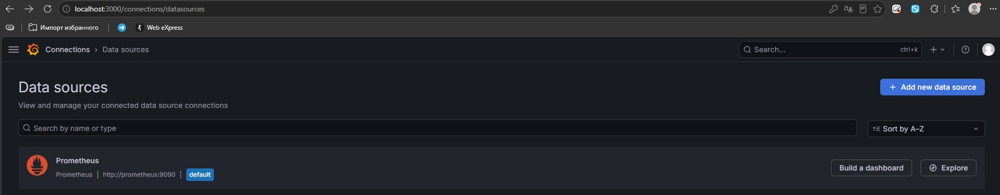

# Домашнее задание к занятию 14 «Средство визуализации Grafana»

## Задание повышенной сложности

**При решении задания 1** не используйте директорию [help](./help) для сборки проекта. Самостоятельно разверните grafana, где в роли источника данных будет выступать prometheus, а сборщиком данных будет node-exporter:

- grafana;
- prometheus-server;
- prometheus node-exporter.

За дополнительными материалами можете обратиться в официальную документацию grafana и prometheus.

В решении к домашнему заданию также приведите все конфигурации, скрипты, манифесты, которые вы 
использовали в процессе решения задания.

**При решении задания 3** вы должны самостоятельно завести удобный для вас канал нотификации, например, Telegram или email, и отправить туда тестовые события.

В решении приведите скриншоты тестовых событий из каналов нотификаций.

## Обязательные задания

### Задание 1

1. Используя директорию [help](./help) внутри этого домашнего задания, запустите связку prometheus-grafana.
1. Зайдите в веб-интерфейс grafana, используя авторизационные данные, указанные в манифесте docker-compose.
1. Подключите поднятый вами prometheus, как источник данных.
1. Решение домашнего задания — скриншот веб-интерфейса grafana со списком подключенных Datasource.



## Задание 2

Изучите самостоятельно ресурсы:

1. [PromQL tutorial for beginners and humans](https://valyala.medium.com/promql-tutorial-for-beginners-9ab455142085).
1. [Understanding Machine CPU usage](https://www.robustperception.io/understanding-machine-cpu-usage).
1. [Introduction to PromQL, the Prometheus query language](https://grafana.com/blog/2020/02/04/introduction-to-promql-the-prometheus-query-language/).

Создайте Dashboard и в ней создайте Panels:

- утилизация CPU для nodeexporter (в процентах, 100-idle);
- CPULA 1/5/15;
- количество свободной оперативной памяти;
- количество места на файловой системе.

Для решения этого задания приведите promql-запросы для выдачи этих метрик, а также скриншот получившейся Dashboard.


## Задание 3

1. Создайте для каждой Dashboard подходящее правило alert — можно обратиться к первой лекции в блоке «Мониторинг».
1. В качестве решения задания приведите скриншот вашей итоговой Dashboard.


## Задание 4

1. Сохраните ваш Dashboard.Для этого перейдите в настройки Dashboard, выберите в боковом меню «JSON MODEL». Далее скопируйте отображаемое json-содержимое в отдельный файл и сохраните его.
1. В качестве решения задания приведите листинг этого файла.

<details>
<summary>Листинг файла JSON MODEL</summary>
```
{
  "annotations": [
    {
      "kind": "AnnotationQuery",
      "spec": {
        "builtIn": true,
        "enable": true,
        "hide": true,
        "iconColor": "rgba(0, 211, 255, 1)",
        "name": "Annotations & Alerts",
        "query": {
          "datasource": {
            "name": "-- Grafana --"
          },
          "group": "grafana",
          "kind": "DataQuery",
          "spec": {},
          "version": "v0"
        }
      }
    }
  ],
  "cursorSync": "Off",
  "description": "Dashboard моей локальной VM01",
  "editable": true,
  "elements": {
    "panel-1": {
      "kind": "Panel",
      "spec": {
        "data": {
          "kind": "QueryGroup",
          "spec": {
            "queries": [
              {
                "kind": "PanelQuery",
                "spec": {
                  "hidden": false,
                  "query": {
                    "datasource": {
                      "name": "PBFA97CFB590B2093"
                    },
                    "group": "prometheus",
                    "kind": "DataQuery",
                    "spec": {
                      "editorMode": "code",
                      "expr": "100 - (avg by (instance) (rate(node_cpu_seconds_total{mode=\"idle\"}[1m])) * 100)",
                      "legendFormat": "__auto",
                      "range": true
                    },
                    "version": "v0"
                  },
                  "refId": "A"
                }
              }
            ],
            "queryOptions": {},
            "transformations": []
          }
        },
        "description": "Утилизация CPU для nodeexporter (в процентах, 100-idle)",
        "id": 1,
        "links": [],
        "title": "Утилизация CPU для nodeexporter",
        "vizConfig": {
          "group": "timeseries",
          "kind": "VizConfig",
          "spec": {
            "fieldConfig": {
              "defaults": {
                "color": {
                  "mode": "palette-classic"
                },
                "custom": {
                  "axisBorderShow": false,
                  "axisCenteredZero": false,
                  "axisColorMode": "text",
                  "axisLabel": "",
                  "axisPlacement": "auto",
                  "barAlignment": 0,
                  "barWidthFactor": 0.6,
                  "drawStyle": "line",
                  "fillOpacity": 0,
                  "gradientMode": "none",
                  "hideFrom": {
                    "legend": false,
                    "tooltip": false,
                    "viz": false
                  },
                  "insertNulls": false,
                  "lineInterpolation": "linear",
                  "lineWidth": 1,
                  "pointSize": 5,
                  "scaleDistribution": {
                    "type": "linear"
                  },
                  "showPoints": "auto",
                  "showValues": false,
                  "spanNulls": false,
                  "stacking": {
                    "group": "A",
                    "mode": "none"
                  },
                  "thresholdsStyle": {
                    "mode": "off"
                  }
                },
                "thresholds": {
                  "mode": "absolute",
                  "steps": [
                    {
                      "color": "green",
                      "value": 0
                    },
                    {
                      "color": "red",
                      "value": 80
                    }
                  ]
                }
              },
              "overrides": []
            },
            "options": {
              "annotations": {
                "clustering": -1,
                "multiLane": false
              },
              "legend": {
                "calcs": [],
                "displayMode": "list",
                "placement": "bottom",
                "showLegend": true
              },
              "tooltip": {
                "hideZeros": false,
                "mode": "single",
                "sort": "none"
              }
            }
          },
          "version": "13.0.2"
        }
      }
    },
    "panel-2": {
      "kind": "Panel",
      "spec": {
        "data": {
          "kind": "QueryGroup",
          "spec": {
            "queries": [
              {
                "kind": "PanelQuery",
                "spec": {
                  "hidden": false,
                  "query": {
                    "datasource": {
                      "name": "PBFA97CFB590B2093"
                    },
                    "group": "prometheus",
                    "kind": "DataQuery",
                    "spec": {
                      "editorMode": "code",
                      "expr": "node_load1",
                      "legendFormat": "__auto",
                      "range": true
                    },
                    "version": "v0"
                  },
                  "refId": "A"
                }
              },
              {
                "kind": "PanelQuery",
                "spec": {
                  "hidden": false,
                  "query": {
                    "datasource": {
                      "name": "PBFA97CFB590B2093"
                    },
                    "group": "prometheus",
                    "kind": "DataQuery",
                    "spec": {
                      "editorMode": "code",
                      "expr": "node_load5",
                      "instant": false,
                      "legendFormat": "__auto",
                      "range": true
                    },
                    "version": "v0"
                  },
                  "refId": "B"
                }
              },
              {
                "kind": "PanelQuery",
                "spec": {
                  "hidden": false,
                  "query": {
                    "datasource": {
                      "name": "PBFA97CFB590B2093"
                    },
                    "group": "prometheus",
                    "kind": "DataQuery",
                    "spec": {
                      "editorMode": "code",
                      "expr": "node_load15",
                      "instant": false,
                      "legendFormat": "__auto",
                      "range": true
                    },
                    "version": "v0"
                  },
                  "refId": "C"
                }
              }
            ],
            "queryOptions": {},
            "transformations": []
          }
        },
        "description": "CPULA 1/5/15",
        "id": 2,
        "links": [],
        "title": "CPULA 1/5/15",
        "transparent": true,
        "vizConfig": {
          "group": "timeseries",
          "kind": "VizConfig",
          "spec": {
            "fieldConfig": {
              "defaults": {
                "color": {
                  "mode": "palette-classic"
                },
                "custom": {
                  "axisBorderShow": false,
                  "axisCenteredZero": false,
                  "axisColorMode": "text",
                  "axisLabel": "",
                  "axisPlacement": "auto",
                  "barAlignment": 0,
                  "barWidthFactor": 0.6,
                  "drawStyle": "line",
                  "fillOpacity": 0,
                  "gradientMode": "none",
                  "hideFrom": {
                    "legend": false,
                    "tooltip": false,
                    "viz": false
                  },
                  "insertNulls": false,
                  "lineInterpolation": "linear",
                  "lineWidth": 1,
                  "pointSize": 5,
                  "scaleDistribution": {
                    "type": "linear"
                  },
                  "showPoints": "auto",
                  "showValues": false,
                  "spanNulls": false,
                  "stacking": {
                    "group": "A",
                    "mode": "none"
                  },
                  "thresholdsStyle": {
                    "mode": "off"
                  }
                },
                "thresholds": {
                  "mode": "absolute",
                  "steps": [
                    {
                      "color": "green",
                      "value": 0
                    },
                    {
                      "color": "red",
                      "value": 80
                    }
                  ]
                }
              },
              "overrides": []
            },
            "options": {
              "annotations": {
                "clustering": -1,
                "multiLane": false
              },
              "legend": {
                "calcs": [],
                "displayMode": "list",
                "placement": "bottom",
                "showLegend": true
              },
              "tooltip": {
                "hideZeros": false,
                "mode": "single",
                "sort": "none"
              }
            }
          },
          "version": "13.0.2"
        }
      }
    },
    "panel-3": {
      "kind": "Panel",
      "spec": {
        "data": {
          "kind": "QueryGroup",
          "spec": {
            "queries": [
              {
                "kind": "PanelQuery",
                "spec": {
                  "hidden": false,
                  "query": {
                    "datasource": {
                      "name": "PBFA97CFB590B2093"
                    },
                    "group": "prometheus",
                    "kind": "DataQuery",
                    "spec": {
                      "editorMode": "code",
                      "expr": "(node_memory_MemFree_bytes + node_memory_Buffers_bytes + node_memory_Cached_bytes) / (1024^3)",
                      "instant": false,
                      "legendFormat": "__auto",
                      "range": true
                    },
                    "version": "v0"
                  },
                  "refId": "B"
                }
              }
            ],
            "queryOptions": {},
            "transformations": []
          }
        },
        "description": "Количество свободной ОП (в гигабайтах)",
        "id": 3,
        "links": [],
        "title": "Количество свободной RAM (в гигабайтах)",
        "vizConfig": {
          "group": "timeseries",
          "kind": "VizConfig",
          "spec": {
            "fieldConfig": {
              "defaults": {
                "color": {
                  "mode": "palette-classic"
                },
                "custom": {
                  "axisBorderShow": false,
                  "axisCenteredZero": false,
                  "axisColorMode": "text",
                  "axisLabel": "",
                  "axisPlacement": "auto",
                  "barAlignment": 0,
                  "barWidthFactor": 0.6,
                  "drawStyle": "line",
                  "fillOpacity": 0,
                  "gradientMode": "none",
                  "hideFrom": {
                    "legend": false,
                    "tooltip": false,
                    "viz": false
                  },
                  "insertNulls": false,
                  "lineInterpolation": "linear",
                  "lineWidth": 1,
                  "pointSize": 5,
                  "scaleDistribution": {
                    "type": "linear"
                  },
                  "showPoints": "auto",
                  "showValues": false,
                  "spanNulls": false,
                  "stacking": {
                    "group": "A",
                    "mode": "none"
                  },
                  "thresholdsStyle": {
                    "mode": "off"
                  }
                },
                "thresholds": {
                  "mode": "absolute",
                  "steps": [
                    {
                      "color": "green",
                      "value": 0
                    },
                    {
                      "color": "red",
                      "value": 80
                    }
                  ]
                }
              },
              "overrides": []
            },
            "options": {
              "annotations": {
                "clustering": -1,
                "multiLane": false
              },
              "legend": {
                "calcs": [],
                "displayMode": "list",
                "placement": "bottom",
                "showLegend": true
              },
              "tooltip": {
                "hideZeros": false,
                "mode": "single",
                "sort": "none"
              }
            }
          },
          "version": "13.0.2"
        }
      }
    },
    "panel-4": {
      "kind": "Panel",
      "spec": {
        "data": {
          "kind": "QueryGroup",
          "spec": {
            "queries": [
              {
                "kind": "PanelQuery",
                "spec": {
                  "hidden": false,
                  "query": {
                    "datasource": {
                      "name": "PBFA97CFB590B2093"
                    },
                    "group": "prometheus",
                    "kind": "DataQuery",
                    "spec": {
                      "editorMode": "code",
                      "expr": "node_filesystem_avail_bytes{mountpoint=\"/\", fstype!~\"tmpfs|devtmpfs\"} / 1073741824",
                      "legendFormat": "__auto",
                      "range": true
                    },
                    "version": "v0"
                  },
                  "refId": "A"
                }
              }
            ],
            "queryOptions": {},
            "transformations": []
          }
        },
        "description": "количество места на файловой системе в гигабайтах",
        "id": 4,
        "links": [],
        "title": "Количество места на файловой системе (в гигабайтах)",
        "vizConfig": {
          "group": "timeseries",
          "kind": "VizConfig",
          "spec": {
            "fieldConfig": {
              "defaults": {
                "color": {
                  "mode": "palette-classic"
                },
                "custom": {
                  "axisBorderShow": false,
                  "axisCenteredZero": false,
                  "axisColorMode": "text",
                  "axisLabel": "",
                  "axisPlacement": "auto",
                  "barAlignment": 0,
                  "barWidthFactor": 0.6,
                  "drawStyle": "line",
                  "fillOpacity": 0,
                  "gradientMode": "none",
                  "hideFrom": {
                    "legend": false,
                    "tooltip": false,
                    "viz": false
                  },
                  "insertNulls": false,
                  "lineInterpolation": "linear",
                  "lineWidth": 1,
                  "pointSize": 5,
                  "scaleDistribution": {
                    "type": "linear"
                  },
                  "showPoints": "auto",
                  "showValues": false,
                  "spanNulls": false,
                  "stacking": {
                    "group": "A",
                    "mode": "none"
                  },
                  "thresholdsStyle": {
                    "mode": "off"
                  }
                },
                "thresholds": {
                  "mode": "absolute",
                  "steps": [
                    {
                      "color": "green",
                      "value": 0
                    },
                    {
                      "color": "red",
                      "value": 80
                    }
                  ]
                }
              },
              "overrides": []
            },
            "options": {
              "annotations": {
                "clustering": -1,
                "multiLane": false
              },
              "legend": {
                "calcs": [],
                "displayMode": "list",
                "placement": "bottom",
                "showLegend": true
              },
              "tooltip": {
                "hideZeros": false,
                "mode": "single",
                "sort": "none"
              }
            }
          },
          "version": "13.0.2"
        }
      }
    },
    "panel-5": {
      "kind": "Panel",
      "spec": {
        "data": {
          "kind": "QueryGroup",
          "spec": {
            "queries": [],
            "queryOptions": {},
            "transformations": []
          }
        },
        "description": "",
        "id": 5,
        "links": [],
        "title": "Аллерты",
        "vizConfig": {
          "group": "alertlist",
          "kind": "VizConfig",
          "spec": {
            "fieldConfig": {
              "defaults": {},
              "overrides": []
            },
            "options": {
              "alertInstanceLabelFilter": "",
              "alertName": "",
              "dashboardAlerts": true,
              "groupBy": [],
              "groupMode": "default",
              "maxItems": 20,
              "showInactiveAlerts": false,
              "sortOrder": 1,
              "stateFilter": {
                "error": true,
                "firing": true,
                "noData": false,
                "normal": true,
                "pending": true,
                "recovering": true
              },
              "viewMode": "list"
            }
          },
          "version": "13.0.2"
        }
      }
    }
  },
  "layout": {
    "kind": "GridLayout",
    "spec": {
      "items": [
        {
          "kind": "GridLayoutItem",
          "spec": {
            "element": {
              "kind": "ElementReference",
              "name": "panel-5"
            },
            "height": 11,
            "width": 7,
            "x": 0,
            "y": 0
          }
        },
        {
          "kind": "GridLayoutItem",
          "spec": {
            "element": {
              "kind": "ElementReference",
              "name": "panel-2"
            },
            "height": 11,
            "width": 9,
            "x": 7,
            "y": 0
          }
        },
        {
          "kind": "GridLayoutItem",
          "spec": {
            "element": {
              "kind": "ElementReference",
              "name": "panel-4"
            },
            "height": 11,
            "width": 7,
            "x": 16,
            "y": 0
          }
        },
        {
          "kind": "GridLayoutItem",
          "spec": {
            "element": {
              "kind": "ElementReference",
              "name": "panel-1"
            },
            "height": 8,
            "width": 10,
            "x": 0,
            "y": 11
          }
        },
        {
          "kind": "GridLayoutItem",
          "spec": {
            "element": {
              "kind": "ElementReference",
              "name": "panel-3"
            },
            "height": 8,
            "width": 10,
            "x": 10,
            "y": 11
          }
        }
      ]
    }
  },
  "links": [],
  "liveNow": false,
  "preferences": {
    "layout": {
      "kind": "GridLayout",
      "spec": {
        "items": []
      }
    }
  },
  "preload": false,
  "tags": [],
  "timeSettings": {
    "autoRefresh": "",
    "autoRefreshIntervals": [
      "5s",
      "10s",
      "30s",
      "1m",
      "5m",
      "15m",
      "30m",
      "1h",
      "2h",
      "1d"
    ],
    "fiscalYearStartMonth": 0,
    "from": "now-1h",
    "hideTimepicker": false,
    "timezone": "browser",
    "to": "now"
  },
  "title": "Мониторинг моей локальной VM01",
  "variables": []
}
```
</details>

---

### Как оформить решение задания

Выполненное домашнее задание пришлите в виде ссылки на .md-файл в вашем репозитории.

---
